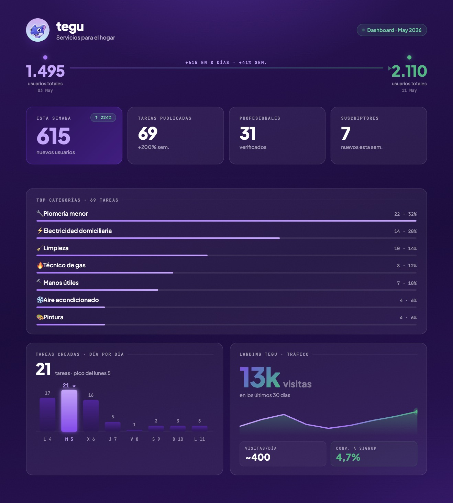
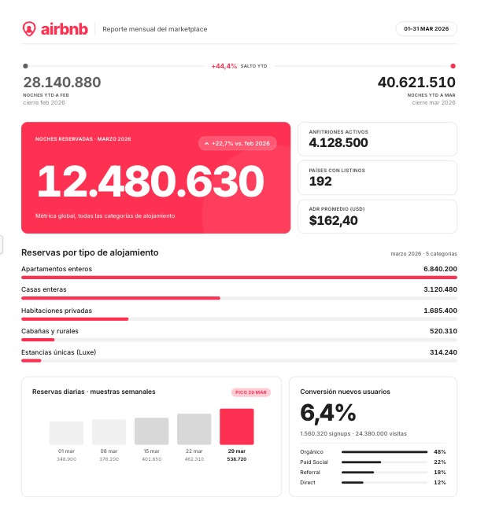
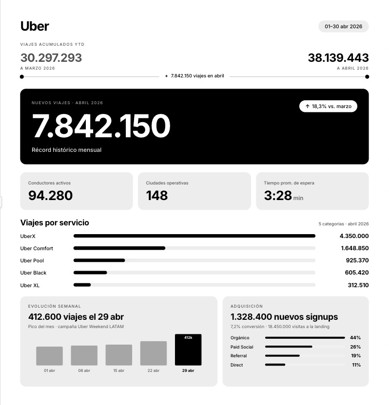

# shipstats — Brand-Aligned Metric Posters for X

[](https://x.com/mativallej_)
[](https://github.com/mativallej/shipstats)


> A single prompt that turns your weekly metrics into a brand-aligned poster for X. JSON in, screenshot-ready HTML out. No install, no SDK, no API key from us.



## Introduction

**shipstats** is a prompt-as-a-tool for founders who ship every week and want to post the progress without losing an hour to Figma.

Drop your numbers, your design system, and (optionally) your logo into [`PROMPT.md`](./PROMPT.md), send it to an LLM with long context, and get back a self-contained `1080×1200` HTML poster — ready to screenshot and tweet.

The structure is fixed on purpose: every week's poster feels like part of the same series. Your brand is what changes.

## Key Features

- **Single Prompt** – Everything lives in `PROMPT.md`. No install, no SDK, no infra.
- **Brand-Aligned** – Typography, palette, gradients, spacing all come from your design system.
- **Fixed Structure** – Header → growth timeline → hero metric + support row → main breakdown → daily peak + supporting stat. Sections omit cleanly when data is missing.
- **Self-Contained HTML** – `1080×1200` canvas, fonts via Google Fonts, logo as base64. One file, zero dependencies.
- **Screenshot-Ready** – Auto-scales to viewport while preserving aspect ratio.
- **Zero Invention** – Only renders numbers present in your data. No hallucinated metrics, no placeholder filler.

## Quick Start

Two paths, same output. Pick one.

### Path A — Claude Code Skill (recommended)

If you use [Claude Code](https://claude.com/claude-code), shipstats ships as a plugin with a Skill that auto-invokes when you ask for a weekly recap.

1. **Install the plugin**

   ```bash
   /plugin marketplace add mativallej/shipstats
   /plugin install shipstats
   ```

   Or upload to **claude.ai** (Settings → Capabilities → Skills, Pro+ plans):

   - **Pre-built zip**: [download `shipstats-skill.zip`](https://drive.google.com/drive/folders/1rmhxaErPVagg_4wLgRcNqoRnXoH2R1Xd?usp=sharing)
   - **Or build it yourself**:

     ```bash
     cd skills && zip -r shipstats-skill.zip shipstats
     ```

   Then upload `shipstats-skill.zip` in the web UI.

2. **Ask Claude for a poster**

   > "Armame el poster semanal con estas métricas: …"

   The Skill auto-loads, asks for any missing input (design system, locale), runs the bundled logo prep script (Python: resize to 128×128 WebP + base64), and writes `shipstats-poster.html` in the current directory.

3. **Screenshot and post.**

Templates shipped with the Skill: [`design-system.md`](./skills/shipstats/templates/design-system.md) (fallback tokens) and [`sample-metrics.json`](./skills/shipstats/templates/sample-metrics.json) (data shape).

### Path B — Plain prompt (any LLM)

Works with Claude, GPT, Gemini, or anything that handles long context. **Recommended: [Claude Opus 4.7](https://www.anthropic.com/claude)** — it follows the layout budget pass cleanly and respects design system tokens without inventing gradients.

1. **Copy the prompt**

   Open [`PROMPT.md`](./PROMPT.md) and copy the full contents.

2. **Fill in the three placeholders**

   - `<data>` — your metrics
   - `<design_system>` — your brand tokens
   - `<logo>` — optional, as a PNG/JPG attachment

3. **Send it to the LLM**

   Paste in chat, attach the logo if you have one, send. Save the returned HTML as `poster.html`.

4. **Screenshot and post.**

## What You Bring

### Your metrics

JSON or plain prose. The richer the better, but at minimum a hero number with a time delta works.

```json
{
  "period": "2026-05-04 to 2026-05-11",
  "summary": { "newUsers": 615, "newUsersDelta": 224 },
  "byCategory": [ { "name": "Tasks", "count": 22 } ],
  "daily": [ { "date": "2026-05-09", "tasks": 21 } ]
}
```

### Your design system

A markdown spec with tokens: primary palette (50–900), neutrals, fonts (sans + mono with weights), named gradients, spacing scale, radius, anti-patterns.

No design system yet? Grab a free one from [getdesign.md](https://getdesign.md/), or pass any reference and the prompt will respect it. Pass nothing and you get sensible defaults.

### Your logo

Optional. PNG or JPG, attached to the chat. Gets embedded as base64 so the HTML stays standalone.

## What You Get

| Field | Value |
|---|---|
| **Format** | Single self-contained HTML file |
| **Canvas** | `1080×1200`, auto-scales to viewport |
| **Fonts** | Loaded via Google Fonts with preconnect |
| **Images** | Embedded as data URIs |
| **Scripts** | None, except the canvas auto-scale |
| **Sections** | Header, optional growth timeline, hero + support row, main breakdown, optional daily peak + supporting stat |

## Tweak It

The prompt is opinionated on structure (so every week's poster matches the last one) but the surface area is yours:

- **Light or dark mode** – controlled by your design system
- **Number formatting and language** – controlled by your locale (`1,234.56` US / `1.234,56` EU / `1.234` AR)
- **Sections** – omit cleanly if data is missing, no placeholder filler

If you want a different fixed structure, edit `PROMPT.md`. The layout sketch and section list are all in one place.

## Examples

| Airbnb — March 2026 | Uber — March 2026 |
|---|---|
|  |  |

Design system references used in these examples:

- [Airbnb DESIGN.md](https://getdesign.md/airbnb/design-md)
- [Uber DESIGN.md](https://getdesign.md/uber/design-md)

PRs welcome with your own.

## Contributing

Contributions are welcome! If you want to improve the prompt, add examples, or refine the layout:

1. Fork the repository.
2. Create a feature branch.
3. Make your changes:
   - **Prompt updates**: Edit [`PROMPT.md`](./PROMPT.md)
   - **New examples**: Add a screenshot to `/examples/` and a row to the table above
4. Open a Pull Request.

**Guidelines:**

- Include a brief description of the brand and design system used in any new example.
- If you change the layout or rules, update the matching section in `PROMPT.md`.
- Keep the prompt opinionated — divergent structures dilute the "series" feel.

## Contact

If you have questions, suggestions, or want to collaborate:

- **Name:** Matías Vallejos
- [matiasvallejos.com](https://matiasvallejos.com)
- [@mativallej_](https://x.com/mativallej_)

## License

This project is open source and available under the [MIT License](LICENSE).

## Inspiration

> "Ship daily. Tell the story weekly."

Built while shipping [Tegu](https://tegu.ar) — and getting tired of opening Figma every Sunday.
